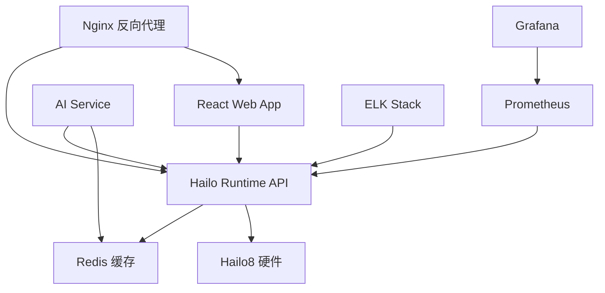

# Docker Compose 部署介绍

🐳 **使用Docker Compose部署Hailo8 AI推理服务的完整指南**

## 📖 什么是Docker Compose？

Docker Compose是一个用于定义和运行多容器Docker应用程序的工具。通过YAML文件配置，您可以一键启动、停止和管理多个相关联的容器服务。

## 🎯 为什么使用Docker Compose部署？

✅ **简单易用**: 一条命令启动整个服务栈
✅ **环境一致性**: 开发、测试、生产环境保持一致
✅ **服务编排**: 自动处理服务依赖关系
✅ **配置管理**: 统一管理所有服务配置
✅ **快速部署**: 极大简化部署流程
✅ **易于维护**: 版本控制和配置管理

## 🏗️ Hailo8服务架构



## 📁 项目文件结构

```
hailo8/containers/
├── 📋 docker-compose.yml           # 主配置文件
├── 📋 docker-compose.dev.yml       # 开发环境配置
├── 📋 docker-compose.remote.yml    # 生产环境配置
├── 📋 docker-compose.quick.yml     # 快速部署配置
├── 📋 .env                         # 环境变量
├── 📋 .env.remote                  # 生产环境变量
├── 📁 hailo-runtime/               # 核心API服务
├── 📁 hailo-web-app/               # Web前端
├── 📁 hailo-ai-service/            # AI服务
├── 📁 nginx/                       # 反向代理
├── 📁 monitoring/                  # 监控配置
└── 📁 models/                      # 模型文件
```

## 🚀 快速开始

### 前置要求

- Docker Engine 20.10+
- Docker Compose 2.0+
- Hailo8 PCIe硬件
- Linux系统 (Ubuntu/CentOS/Debian)

### 安装Docker和Docker Compose

```bash
# Ubuntu/Debian
curl -fsSL https://get.docker.com | sh
sudo usermod -aG docker $USER
sudo curl -L "https://github.com/docker/compose/releases/latest/download/docker-compose-$(uname -s)-$(uname -m)" -o /usr/local/bin/docker-compose
sudo chmod +x /usr/local/bin/docker-compose

# 重新登录以生效Docker组权限
newgrp docker
```

### 基本部署流程

#### 1. 克隆项目

```bash
git clone https://github.com/SunvidWong/hailo8.git
cd hailo8/containers
```

#### 2. 配置环境变量

```bash
# 复制环境变量模板
cp .env.remote .env

# 编辑配置 (至少修改以下项)
vim .env
```

**必须修改的配置项:**
```bash
DOMAIN=your-domain.com                # 您的域名
JWT_SECRET_KEY=your-secret-key       # 生成强密钥
GRAFANA_PASSWORD=your-password       # 设置管理员密码
```

#### 3. 启动服务

```bash
# 选择一个配置文件启动服务

# 选项1: 快速部署 (推荐初次使用)
docker-compose -f docker-compose.quick.yml up -d

# 选项2: 开发环境
docker-compose -f docker-compose.dev.yml up -d

# 选项3: 生产环境
docker-compose -f docker-compose.remote.yml up -d
```

#### 4. 验证部署

```bash
# 检查服务状态
docker-compose ps

# 查看服务日志
docker-compose logs

# 访问API文档
curl http://localhost:8000/docs
```

## 📋 Docker Compose配置详解

### 主配置文件结构

```yaml
version: '3.8'

services:
  # 服务定义
  service-name:
    build: ./service-directory          # 构建配置
    image: image-name:tag              # 镜像名称
    container_name: container-name      # 容器名称
    restart: unless-stopped             # 重启策略
    ports:                             # 端口映射
      - "8000:8000"
    volumes:                           # 数据卷
      - ./local-path:/container-path
    environment:                       # 环境变量
      - VAR=value
    depends_on:                        # 服务依赖
      - other-service
    healthcheck:                       # 健康检查
      test: ["CMD", "health-check-cmd"]
      interval: 30s
      timeout: 10s
      retries: 3
    networks:                          # 网络配置
      - network-name

volumes:                              # 数据卷定义
  volume-name:
    driver: local

networks:                             # 网络定义
  network-name:
    driver: bridge
```

### 核心服务配置示例

#### 1. Hailo Runtime服务

```yaml
hailo-runtime:
  build:
    context: ./hailo-runtime
    dockerfile: Dockerfile
  image: hailo8/runtime:latest
  container_name: hailo-runtime
  restart: unless-stopped
  privileged: true                    # 需要加载内核模块
  ports:
    - "8000:8000"                     # HTTP API
    - "50051:50051"                   # gRPC服务
  volumes:
    - /dev/hailo0:/dev/hailo0          # Hailo设备映射
    - ./models:/app/models:ro          # 模型文件 (只读)
    - ./logs:/app/logs                 # 日志文件
  environment:
    - HAILO_API_HOST=0.0.0.0
    - LOG_LEVEL=INFO
    - REDIS_URL=redis://redis:6379
  depends_on:
    - redis
  healthcheck:
    test: ["CMD", "curl", "-f", "http://localhost:8000/health"]
    interval: 30s
    timeout: 10s
    retries: 3
```

#### 2. Redis缓存服务

```yaml
redis:
  image: redis:7-alpine
  container_name: hailo-redis
  restart: unless-stopped
  ports:
    - "6379:6379"
  volumes:
    - redis_data:/data
  command: redis-server --appendonly yes
  healthcheck:
    test: ["CMD", "redis-cli", "ping"]
    interval: 10s
    timeout: 5s
    retries: 3
```

#### 3. Web前端服务

```yaml
hailo-web-app:
  build:
    context: ./hailo-web-app
    dockerfile: Dockerfile
  image: hailo8/web-app:latest
  container_name: hailo-web-app
  restart: unless-stopped
  ports:
    - "3000:3000"
  environment:
    - REACT_APP_API_URL=http://localhost:8000
  depends_on:
    - hailo-runtime
  healthcheck:
    test: ["CMD", "curl", "-f", "http://localhost:3000"]
    interval: 30s
    timeout: 10s
    retries: 3
```

#### 4. Nginx反向代理

```yaml
nginx:
  image: nginx:alpine
  container_name: hailo-nginx
  restart: unless-stopped
  ports:
    - "80:80"
    - "443:443"
  volumes:
    - ./nginx/nginx.conf:/etc/nginx/nginx.conf:ro
    - ./nginx/ssl:/etc/nginx/ssl:ro
  depends_on:
    - hailo-runtime
    - hailo-web-app
  healthcheck:
    test: ["CMD", "nginx", "-t"]
    interval: 30s
    timeout: 5s
    retries: 3
```

## 🔧 常用Docker Compose命令

### 基本命令

```bash
# 启动所有服务 (后台运行)
docker-compose up -d

# 启动服务并显示日志
docker-compose up

# 停止所有服务
docker-compose down

# 停止服务并删除数据卷
docker-compose down -v

# 重新构建并启动服务
docker-compose up --build

# 强制重新构建镜像
docker-compose build --no-cache
```

### 管理命令

```bash
# 查看服务状态
docker-compose ps

# 查看服务日志
docker-compose logs

# 实时查看日志
docker-compose logs -f

# 查看特定服务日志
docker-compose logs -f hailo-runtime

# 重启特定服务
docker-compose restart hailo-runtime

# 停止特定服务
docker-compose stop hailo-runtime

# 启动特定服务
docker-compose start hailo-runtime
```

### 维护命令

```bash
# 拉取最新镜像
docker-compose pull

# 更新服务
docker-compose pull
docker-compose up -d

# 查看资源使用情况
docker-compose top

# 执行命令进入容器
docker-compose exec hailo-runtime bash

# 查看网络配置
docker-compose network ls
```

## 🌐 不同部署方案

### 方案1: 快速部署 (适合测试)

```yaml
# docker-compose.quick.yml
version: '3.8'

services:
  hailo-runtime:
    build: ./hailo-runtime
    ports:
      - "8000:8000"
    volumes:
      - /dev/hailo0:/dev/hailo0
    environment:
      - LOG_LEVEL=INFO

  redis:
    image: redis:7-alpine
    ports:
      - "6379:6379"
```

**启动命令:**
```bash
docker-compose -f docker-compose.quick.yml up -d
```

### 方案2: 开发环境部署

```yaml
# docker-compose.dev.yml
version: '3.8'

services:
  hailo-runtime:
    build: ./hailo-runtime
    volumes:
      - ./hailo-runtime:/app               # 源码挂载，支持热重载
      - /dev/hailo0:/dev/hailo0
    environment:
      - DEBUG=true
      - LOG_LEVEL=DEBUG
    command: uvicorn main:app --reload      # 开发模式

  hailo-web-app:
    build: ./hailo-web-app
    volumes:
      - ./hailo-web-app:/app              # 源码挂载
    command: npm start                     # 开发模式
```

**启动命令:**
```bash
docker-compose -f docker-compose.dev.yml up -d
```

### 方案3: 生产环境部署

```yaml
# docker-compose.remote.yml
version: '3.8'

services:
  hailo-runtime:
    image: hailo8/runtime:2.0.0
    restart: unless-stopped
    deploy:
      resources:
        limits:
          cpus: '2.0'
          memory: 4G
    healthcheck:
      test: ["CMD", "/app/scripts/health_check.sh"]
      interval: 30s
      timeout: 10s
      retries: 3

  nginx:
    image: nginx:alpine
    volumes:
      - ./nginx/nginx.conf:/etc/nginx/nginx.conf:ro
      - ./nginx/ssl:/etc/nginx/ssl:ro
    ports:
      - "80:80"
      - "443:443"

  prometheus:
    image: prom/prometheus:latest
    volumes:
      - ./monitoring/prometheus.yml:/etc/prometheus/prometheus.yml:ro
      - prometheus_data:/prometheus
    ports:
      - "9090:9090"
```

**启动命令:**
```bash
# 1. 配置环境变量
cp .env.remote .env
vim .env

# 2. 启动生产服务
docker-compose -f docker-compose.remote.yml up -d
```

## 🔍 环境变量配置

### .env 文件示例

```bash
# 基本配置
DOMAIN=localhost
VERSION=2.0.0
LOG_LEVEL=INFO
DEBUG=false
TZ=Asia/Shanghai

# API配置
HAILO_API_HOST=0.0.0.0
HAILO_API_PORT=8000
HAILO_GRPC_PORT=50051

# 数据库配置
REDIS_URL=redis://redis:6379

# 安全配置
JWT_SECRET_KEY=your-secret-key
GRAFANA_PASSWORD=admin123

# 存储配置
DATA_PATH=./data
```

### 在compose文件中使用环境变量

```yaml
services:
  hailo-runtime:
    environment:
      - HAILO_API_HOST=${HAILO_API_HOST}
      - HAILO_API_PORT=${HAILO_API_PORT}
      - LOG_LEVEL=${LOG_LEVEL}
      - JWT_SECRET_KEY=${JWT_SECRET_KEY}

    volumes:
      - ${DATA_PATH}/models:/app/models
      - ${DATA_PATH}/logs:/app/logs
```

## 📊 服务监控和日志

### 查看服务状态

```bash
# 所有服务状态
docker-compose ps

# 详细状态信息
docker-compose ps --format "table {{.Name}}\t{{.Status}}\t{{.Ports}}"
```

### 日志管理

```bash
# 查看所有服务日志
docker-compose logs

# 查看特定服务日志
docker-compose logs hailo-runtime

# 实时跟踪日志
docker-compose logs -f

# 查看最近的日志
docker-compose logs --tail=100 hailo-runtime

# 将日志输出到文件
docker-compose logs > docker-compose.log 2>&1
```

### 资源监控

```bash
# 查看容器资源使用
docker stats

# 查看特定容器资源使用
docker stats hailo-runtime

# 查看容器详细信息
docker inspect hailo-runtime
```

## 🛠️ 故障排除

### 常见问题

#### 1. 服务启动失败

```bash
# 查看详细错误信息
docker-compose logs service-name

# 检查配置文件语法
docker-compose config

# 重新构建镜像
docker-compose build --no-cache service-name
```

#### 2. 端口冲突

```bash
# 检查端口占用
netstat -tlnp | grep :8000

# 修改端口映射
vim docker-compose.yml
```

#### 3. 权限问题

```bash
# 检查设备权限
ls -la /dev/hailo*

# 设置设备权限
sudo chmod 666 /dev/hailo*
sudo usermod -a -G docker $USER
newgrp docker
```

#### 4. 资源不足

```bash
# 检查系统资源
free -h
df -h

# 调整容器资源限制
vim docker-compose.yml
```

### 调试技巧

```bash
# 进入容器调试
docker-compose exec hailo-runtime bash

# 查看容器内进程
docker-compose exec hailo-runtime ps aux

# 查看网络连接
docker-compose exec hailo-runtime netstat -tlnp

# 测试服务连通性
docker-compose exec hailo-runtime curl http://localhost:8000/health
```

## 📈 性能优化

### 资源限制配置

```yaml
services:
  hailo-runtime:
    deploy:
      resources:
        limits:                    # 资源上限
          cpus: '2.0'
          memory: 4G
        reservations:               # 资源预留
          cpus: '1.0'
          memory: 2G
```

### 网络优化

```yaml
networks:
  hailo-network:
    driver: bridge
    ipam:
      config:
        - subnet: 172.20.0.0/16
```

### 存储优化

```yaml
volumes:
  hailo_logs:
    driver: local
    driver_opts:
      type: none
      o: bind
      device: /opt/hailo8/logs
```

## 🔄 更新和维护

### 更新服务

```bash
# 1. 备份数据
docker-compose exec hailo-runtime tar -czf /backup/data-$(date +%Y%m%d).tar.gz /app/data

# 2. 拉取最新镜像
docker-compose pull

# 3. 重新构建自定义镜像
docker-compose build

# 4. 重启服务
docker-compose up -d

# 5. 验证更新
docker-compose ps
curl http://localhost:8000/health
```

### 数据备份

```bash
# 备份数据卷
docker run --rm -v hailo_data:/data -v $(pwd)/backup:/backup alpine tar -czf /backup/data-backup.tar.gz -C /data .

# 备份配置文件
tar -czf config-backup.tar.gz .env docker-compose.yml nginx/ monitoring/
```

### 扩展部署

```bash
# 增加服务副本数
docker-compose up -d --scale hailo-ai-service=3

# 添加新服务
# 在docker-compose.yml中添加新的服务定义
docker-compose up -d new-service
```

## 📚 进一步学习

### 官方文档
- [Docker Compose 官方文档](https://docs.docker.com/compose/)
- [Docker Compose 文件参考](https://docs.docker.com/compose/compose-file/)

### 相关工具
- **Portainer**: Web界面的Docker管理工具
- **Watchtower**: 自动更新Docker镜像
- **Docker Swarm**: Docker集群管理
- **Kubernetes**: 容器编排平台

---

🎉 **现在您已经掌握了使用Docker Compose部署Hailo8的完整知识！**

从简单的单机部署到复杂的生产环境，Docker Compose都能提供强大而灵活的解决方案。开始您的Hailo8 AI推理服务部署吧！