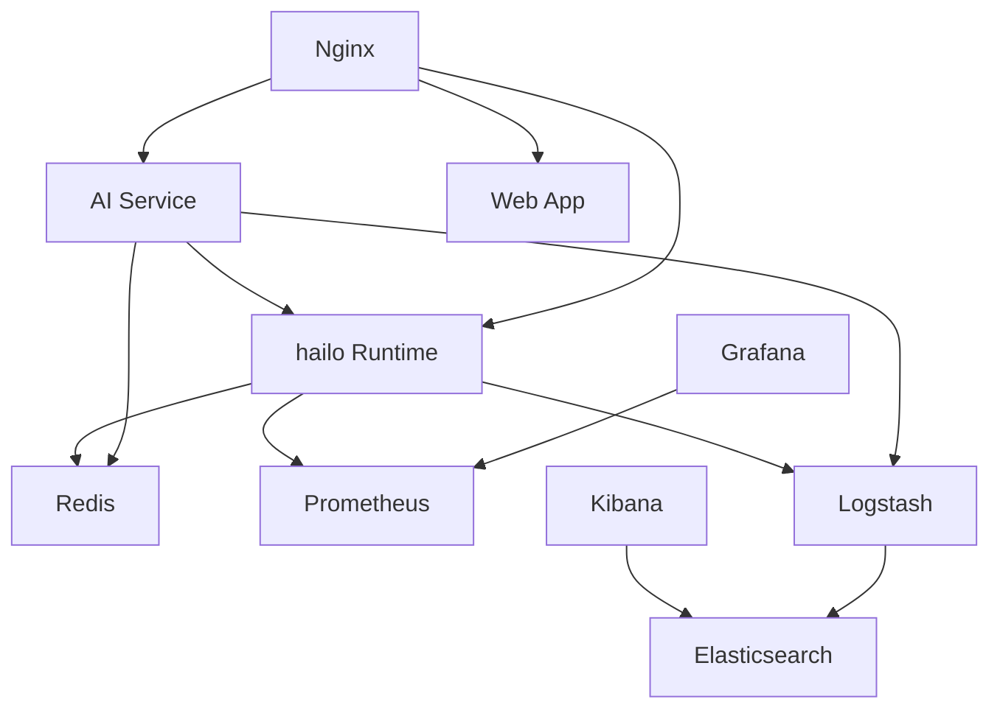

# Docker Compose 远程部署配置说明

🚀 **完整的Hailo8容器化服务远程部署指南**

## 📖 概述

本指南详细说明了如何使用Docker Compose在生产环境中远程部署Hailo8 AI推理服务，包含完整的配置、部署、监控和运维流程。

## 🏗️ 服务架构

### 核心服务组件

```
hailo8-production/
├── 🎯 API服务层
│   ├── hailo-runtime         # 核心AI推理服务
│   ├── hailo-ai-service      # AI应用服务 (多副本)
│   └── nginx                 # 反向代理和负载均衡
├── 📊 监控体系
│   ├── prometheus           # 指标收集
│   ├── grafana              # 可视化监控
│   └── elasticsearch        # 日志存储
├── 💾 数据存储
│   ├── redis                # 缓存服务
│   └── elasticsearch        # 搜索引擎
├── 🔧 运维工具
│   ├── watchtower           # 自动更新
│   ├── db-backup           # 自动备份
│   └── logstash            # 日志处理
└── 🖥️ 前端界面
    └── hailo-web-app        # React应用
```

### 服务依赖关系



## 📋 配置文件详解

### 1. 主配置文件: `docker-compose.remote.yml`

#### 核心配置说明

```yaml
version: '3.8'

services:
  # Hailo8 运行时容器 (核心服务)
  hailo-runtime:
    build:
      context: ./hailo-runtime
      args:
        - BUILD_DATE=${BUILD_DATE}
        - VERSION=${VERSION}
    image: hailo8/runtime:${VERSION:-2.0.0}
    restart: unless-stopped
    privileged: true  # 必须加载内核模块
    ports:
      - "8000:8000"    # HTTP API
      - "50051:50051"  # gRPC服务
      - "9090:9090"    # Prometheus指标
    volumes:
      # 设备访问 - 关键配置
      - /dev/hailo0:/dev/hailo0
      - /dev/hailo1:/dev/hailo1
      - /lib/modules:/lib/modules:ro  # 内核模块
      # 数据持久化
      - hailo_models:/app/models:ro
      - hailo_logs:/app/logs
    environment:
      - HAILO_API_HOST=0.0.0.0
      - LOG_LEVEL=${LOG_LEVEL:-INFO}
      - REDIS_URL=redis://redis:6379
    healthcheck:
      test: ["CMD", "/app/scripts/health_check.sh"]
      interval: 30s
      timeout: 10s
      retries: 3
    deploy:
      resources:
        limits:
          cpus: '2.0'
          memory: 4G  # 根据硬件调整
```

#### 网络配置

```yaml
networks:
  hailo-network:
    driver: bridge
    ipam:
      config:
        - subnet: 172.20.0.0/16  # 自定义网段
```

#### 数据卷配置

```yaml
volumes:
  hailo_models:
    driver: local
    driver_opts:
      type: none
      o: bind
      device: ${DATA_PATH:-/opt/hailo8/data}/models
```

### 2. 环境变量配置: `.env.remote`

#### 必需配置项

```bash
# ==========================================
# 基本配置 (必须修改)
# ==========================================
DOMAIN=hailo-api.yourdomain.com          # 您的域名
API_URL=https://hailo-api.yourdomain.com  # API服务地址
VERSION=2.0.0                            # 服务版本号
DATA_PATH=/opt/hailo8/data               # 数据存储路径

# ==========================================
# 安全配置 (必须修改)
# ==========================================
JWT_SECRET_KEY=your-super-secret-jwt-key-change-this-in-production-2024
GRAFANA_PASSWORD=your-secure-password-change-this

# ==========================================
# 时区和日志配置
# ==========================================
TZ=Asia/Shanghai                         # 时区设置
LOG_LEVEL=INFO                           # 日志级别
```

#### 可选配置项

```bash
# ==========================================
# 性能调优
# ==========================================
HAILO_RUNTIME_CPU_LIMIT=2.0
HAILO_RUNTIME_MEMORY_LIMIT=4g
AI_SERVICE_REPLICAS=2                    # AI服务副本数

# ==========================================
# 监控配置
# ==========================================
PROMETHEUS_RETENTION=30d                 # 数据保留时间
BACKUP_SCHEDULE=0 2 * * *               # 备份时间 (每天凌晨2点)

# ==========================================
# 自动更新配置
# ==========================================
WATCHTOWER_ENABLED=true
WATCHTOWER_POLL_INTERVAL=3600            # 检查间隔 (秒)
```

### 3. Nginx配置: `nginx/nginx.conf`

#### 主要配置说明

```nginx
# API代理配置
location /api/ {
    limit_req zone=api_limit burst=20 nodelay;  # 限流

    proxy_pass http://hailo_runtime;
    proxy_set_header Host $host;
    proxy_set_header X-Forwarded-Proto $scheme;

    # 缓存配置
    proxy_cache hailo_cache;
    proxy_cache_valid 200 5m;

    # WebSocket支持
    proxy_http_version 1.1;
    proxy_set_header Upgrade $http_upgrade;
    proxy_set_header Connection "upgrade";
}

# gRPC代理 (需要HTTP/2)
location /grpc/ {
    grpc_pass grpc://hailo-runtime:50051;
    grpc_connect_timeout 60s;
    client_max_body_size 100M;
}
```

## 🚀 部署流程

### 第一步: 环境准备

#### 1.1 服务器要求检查

```bash
# 检查系统配置
lscpu | grep "Model name"      # CPU信息
free -h                         # 内存信息
df -h                          # 磁盘信息
uname -r                       # 内核版本

# 检查Hailo硬件
lspci | grep -i hailo           # PCIe设备
ls -la /dev/hailo*              # 设备节点
```

#### 1.2 安装Docker (如果未安装)

```bash
# Ubuntu/Debian
curl -fsSL https://get.docker.com | sh
systemctl start docker
systemctl enable docker

# CentOS/RHEL
yum install -y yum-utils
yum-config-manager --add-repo https://download.docker.com/linux/centos/docker-ce.repo
yum install -y docker-ce docker-ce-cli containerd.io
systemctl start docker
systemctl enable docker
```

#### 1.3 安装Docker Compose

```bash
# 下载Docker Compose
curl -L "https://github.com/docker/compose/releases/latest/download/docker-compose-$(uname -s)-$(uname -m)" -o /usr/local/bin/docker-compose
chmod +x /usr/local/bin/docker-compose
ln -sf /usr/local/bin/docker-compose /usr/bin/docker-compose

# 验证安装
docker-compose --version
```

### 第二步: 配置文件准备

#### 2.1 下载项目文件

```bash
# 克隆项目
git clone https://github.com/SunvidWong/hailo8.git
cd hailo8/containers

# 复制配置模板
cp .env.remote .env
```

#### 2.2 修改环境变量

```bash
# 编辑环境变量
vim .env
```

**关键配置项说明:**

```bash
# 修改这些配置
DOMAIN=your-domain.com                    # 替换为您的域名
JWT_SECRET_KEY=your-random-secret-key     # 生成强密钥
GRAFANA_PASSWORD=your-admin-password      # 设置管理密码
DATA_PATH=/opt/hailo8/data               # 数据存储路径

# 根据硬件调整资源限制
HAILO_RUNTIME_MEMORY_LIMIT=8g            # 如果内存充足
AI_SERVICE_REPLICAS=3                     # 增加副本数
```

#### 2.3 配置SSL证书 (HTTPS)

**方案1: Let's Encrypt免费证书**

```bash
# 在服务器上申请证书
sudo apt install certbot python3-certbot-nginx
sudo certbot --nginx -d your-domain.com
```

**方案2: 自签名证书 (测试用)**

```bash
# 生成自签名证书
mkdir -p nginx/ssl
openssl req -x509 -nodes -days 365 -newkey rsa:2048 \
  -keyout nginx/ssl/key.pem \
  -out nginx/ssl/cert.pem \
  -subj "/C=CN/ST=State/L=City/O=Hailo8/CN=your-domain.com"
```

### 第三步: 执行部署

#### 3.1 使用自动化脚本 (推荐)

```bash
# 基本部署
./deploy-remote.sh 192.168.1.100

# 指定用户和端口
./deploy-remote.sh -u deploy -p 2222 192.168.1.100

# 带备份的安全部署
./deploy-remote.sh -b 192.168.1.100
```

#### 3.2 手动部署步骤

```bash
# 1. 上传文件到服务器
scp -r ./* root@your-server:/opt/hailo8/

# 2. SSH连接到服务器
ssh root@your-server
cd /opt/hailo8

# 3. 创建数据目录
mkdir -p data/{models,logs,temp,uploads,outputs}

# 4. 设置权限
chmod +x deploy-remote.sh
chmod +x scripts/*.sh

# 5. 拉取镜像
docker-compose -f docker-compose.remote.yml pull

# 6. 构建自定义镜像
docker-compose -f docker-compose.remote.yml build

# 7. 启动服务
docker-compose -f docker-compose.remote.yml up -d
```

### 第四步: 验证部署

#### 4.1 检查服务状态

```bash
# 查看所有服务状态
docker-compose -f docker-compose.remote.yml ps

# 查看服务日志
docker-compose -f docker-compose.remote.yml logs -f

# 检查容器资源使用
docker stats
```

#### 4.2 健康检查

```bash
# API服务健康检查
curl http://localhost:8000/health

# Web应用检查
curl http://localhost:3000

# 监控服务检查
curl http://localhost:3001/api/health
```

#### 4.3 硬件设备验证

```bash
# 检查Hailo设备权限
ls -la /dev/hailo*

# 检查驱动加载
lsmod | grep hailo

# 查看设备信息
lspci -d 1e52: -v
```

## 🔧 配置调优

### 1. 性能优化

#### 1.1 资源限制调整

```yaml
# docker-compose.remote.yml
services:
  hailo-runtime:
    deploy:
      resources:
        limits:
          cpus: '4.0'           # 根据CPU核心数调整
          memory: 8G           # 根据内存大小调整
        reservations:
          cpus: '2.0'
          memory: 4G
```

#### 1.2 并发配置优化

```yaml
services:
  hailo-ai-service:
    deploy:
      replicas: 4              # 增加副本数
    environment:
      - WORKER_THREADS=8       # 增加工作线程
      - MAX_CONCURRENT_REQUESTS=20
```

#### 1.3 系统参数调优

```bash
# 在服务器上执行
echo 'vm.max_map_count=262144' >> /etc/sysctl.conf
echo 'net.core.somaxconn=65535' >> /etc/sysctl.conf
echo 'fs.file-max=2097152' >> /etc/sysctl.conf
sysctl -p
```

### 2. 安全配置

#### 2.1 网络安全

```yaml
# 防火墙配置
networks:
  hailo-network:
    driver: bridge
    internal: false         # 允许外网访问
    ipam:
      config:
        - subnet: 172.20.0.0/16
          gateway: 172.20.0.1
    labels:
      - "traefik.docker.network=hailo-network"
```

#### 2.2 访问控制

```nginx
# nginx.conf
location /admin {
    allow 192.168.0.0/16;   # 仅内网访问
    allow 127.0.0.1;
    deny all;

    auth_basic "Admin Area";
    auth_basic_user_file /etc/nginx/.htpasswd;
}
```

#### 2.3 SSL安全配置

```nginx
# nginx.conf
ssl_protocols TLSv1.2 TLSv1.3;
ssl_ciphers ECDHE-ECDSA-AES128-GCM-SHA256:ECDHE-RSA-AES128-GCM-SHA256;
ssl_prefer_server_ciphers off;

# HSTS
add_header Strict-Transport-Security "max-age=63072000" always;

# 其他安全头
add_header X-Frame-Options DENY;
add_header X-Content-Type-Options nosniff;
add_header X-XSS-Protection "1; mode=block";
```

### 3. 监控配置

#### 3.1 Prometheus配置

```yaml
# monitoring/prometheus.yml
global:
  scrape_interval: 15s
  evaluation_interval: 15s

scrape_configs:
  - job_name: 'hailo-runtime'
    static_configs:
      - targets: ['hailo-runtime:9090']
    scrape_interval: 10s
    metrics_path: /metrics
```

#### 3.2 Grafana仪表板

```json
{
  "dashboard": {
    "title": "Hailo8 Service Monitor",
    "panels": [
      {
        "title": "API Response Time",
        "targets": [
          {
            "expr": "histogram_quantile(0.95, rate(http_request_duration_seconds_bucket[5m]))"
          }
        ]
      }
    ]
  }
}
```

#### 3.3 告警规则

```yaml
# monitoring/rules/alerts.yml
groups:
  - name: hailo8_alerts
    rules:
      - alert: HighErrorRate
        expr: rate(http_requests_total{status=~"5.."}[5m]) > 0.1
        for: 5m
        labels:
          severity: critical
        annotations:
          summary: "High error rate detected"
```

## 🔍 故障排除

### 常见问题诊断

#### 1. 容器启动失败

```bash
# 查看详细错误日志
docker-compose -f docker-compose.remote.yml logs hailo-runtime

# 检查资源使用
docker stats

# 检查磁盘空间
df -h

# 检查内存使用
free -h
```

#### 2. API服务访问问题

```bash
# 检查网络连通性
docker exec hailo-runtime curl localhost:8000/health

# 检查端口映射
netstat -tlnp | grep :8000

# 检查防火墙
ufw status
iptables -L
```

#### 3. 硬件设备访问问题

```bash
# 检查设备权限
ls -la /dev/hailo*

# 检查容器设备映射
docker exec hailo-runtime ls -la /dev/hailo*

# 查看内核日志
dmesg | grep hailo

# 重新配置设备权限
./setup_device_permissions.sh
```

#### 4. 性能问题

```bash
# 检查CPU使用
top
htop

# 检查内存使用
free -h
docker stats

# 检查网络连接
netstat -i
ss -tuln

# 分析慢查询
docker-compose logs hailo-runtime | grep "slow"
```

### 日志分析

#### 1. 服务日志

```bash
# 实时查看日志
docker-compose -f docker-compose.remote.yml logs -f

# 查看特定服务日志
docker-compose -f docker-compose.remote.yml logs -f hailo-runtime

# 查看最近的日志
docker-compose -f docker-compose.remote.yml logs --tail=100 hailo-runtime
```

#### 2. 系统日志

```bash
# 查看系统日志
journalctl -u docker
journalctl -f

# 查看内核日志
dmesg | tail -100
dmesg -T | grep hailo
```

#### 3. 应用日志

```bash
# 查看API日志
tail -f data/logs/api.log

# 查看Nginx日志
tail -f /var/log/nginx/access.log
tail -f /var/log/nginx/error.log

# 查看Redis日志
docker exec hailo-redis tail -f /var/log/redis/redis-server.log
```

## 📊 监控和维护

### 日常运维任务

#### 1. 服务监控

```bash
# 每日检查脚本
#!/bin/bash
echo "=== 服务状态检查 ==="
docker-compose -f /opt/hailo8/docker-compose.remote.yml ps

echo "=== 资源使用情况 ==="
docker stats --no-stream

echo "=== 磁盘使用情况 ==="
df -h /opt/hailo8

echo "=== API健康检查 ==="
curl -s http://localhost:8000/health | jq .
```

#### 2. 备份管理

```bash
# 自动备份脚本
#!/bin/bash
BACKUP_DIR="/opt/hailo8/backups"
DATE=$(date +%Y%m%d_%H%M%S)

# 备份数据目录
tar -czf "$BACKUP_DIR/data_backup_$DATE.tar.gz" /opt/hailo8/data

# 备份配置文件
tar -czf "$BACKUP_DIR/config_backup_$DATE.tar.gz" /opt/hailo8/.env /opt/hailo8/docker-compose.remote.yml

# 清理旧备份 (保留7天)
find "$BACKUP_DIR" -name "*.tar.gz" -mtime +7 -delete
```

#### 3. 更新升级

```bash
# 更新脚本
#!/bin/bash
cd /opt/hailo8

# 备份当前版本
docker-compose -f docker-compose.remote.yml down
./backup-script.sh

# 拉取最新镜像
docker-compose -f docker-compose.remote.yml pull

# 重新构建
docker-compose -f docker-compose.remote.yml build

# 启动服务
docker-compose -f docker-compose.remote.yml up -d

# 验证更新
sleep 30
./health-check.sh
```

### 扩展部署

#### 1. 多节点部署

```yaml
# docker-compose.cluster.yml
version: '3.8'

services:
  hailo-runtime:
    image: hailo8/runtime:2.0.0
    deploy:
      replicas: 3
      placement:
        constraints:
          - node.labels.hailo8 == true
    volumes:
      - /dev/hailo0:/dev/hailo0
```

#### 2. 负载均衡配置

```nginx
# nginx.conf
upstream hailo_runtime_cluster {
    least_conn;
    server hailo-runtime-1:8000 max_fails=3 fail_timeout=30s;
    server hailo-runtime-2:8000 max_fails=3 fail_timeout=30s;
    server hailo-runtime-3:8000 max_fails=3 fail_timeout=30s;
}
```

#### 3. Kubernetes部署

```yaml
# k8s/hailo-runtime-deployment.yaml
apiVersion: apps/v1
kind: Deployment
metadata:
  name: hailo-runtime
spec:
  replicas: 3
  selector:
    matchLabels:
      app: hailo-runtime
  template:
    spec:
      containers:
      - name: hailo-runtime
        image: hailo8/runtime:2.0.0
        resources:
          requests:
            memory: "2Gi"
            cpu: "1000m"
          limits:
            memory: "4Gi"
            cpu: "2000m"
        volumeMounts:
        - name: hailo-device
          mountPath: /dev/hailo0
      volumes:
      - name: hailo-device
        hostPath:
          path: /dev/hailo0
```

## 📚 附录

### 端口列表

| 服务 | 端口 | 协议 | 说明 |
|------|------|------|------|
| Hailo Runtime API | 8000 | HTTP | 主要API服务 |
| Hailo Runtime gRPC | 50051 | gRPC | gRPC接口 |
| Web应用 | 3000 | HTTP | React前端 |
| AI服务 | 8080 | HTTP | AI应用服务 |
| Nginx HTTP | 80 | HTTP | HTTP重定向 |
| Nginx HTTPS | 443 | HTTPS | HTTPS主服务 |
| Redis | 6379 | TCP | 缓存服务 |
| Prometheus | 9090 | HTTP | 监控指标 |
| Grafana | 3001 | HTTP | 监控面板 |
| Elasticsearch | 9200 | HTTP | 搜索引擎 |
| Kibana | 5601 | HTTP | 日志分析 |

### 目录结构

```
/opt/hailo8/
├── docker-compose.remote.yml    # 主配置文件
├── .env                         # 环境变量
├── data/                        # 数据目录
│   ├── models/                  # 模型文件
│   ├── logs/                    # 日志文件
│   ├── temp/                    # 临时文件
│   ├── uploads/                 # 上传文件
│   └── outputs/                 # 输出文件
├── nginx/                       # Nginx配置
│   └── ssl/                     # SSL证书
├── monitoring/                  # 监控配置
│   ├── prometheus.yml           # Prometheus配置
│   └── grafana/                 # Grafana配置
├── backups/                     # 备份文件
└── scripts/                     # 运维脚本
```

### 环境变量参考

| 变量名 | 默认值 | 说明 |
|--------|--------|------|
| DOMAIN | localhost | 服务域名 |
| VERSION | 2.0.0 | 服务版本 |
| LOG_LEVEL | INFO | 日志级别 |
| TZ | Asia/Shanghai | 时区 |
| DATA_PATH | /opt/hailo8/data | 数据路径 |
| JWT_SECRET_KEY | - | JWT密钥 |
| GRAFANA_PASSWORD | admin123 | Grafana密码 |

---

🎉 **现在您已经掌握了完整的Docker Compose远程部署配置！**

如有问题，请参考故障排除部分或查看完整文档。